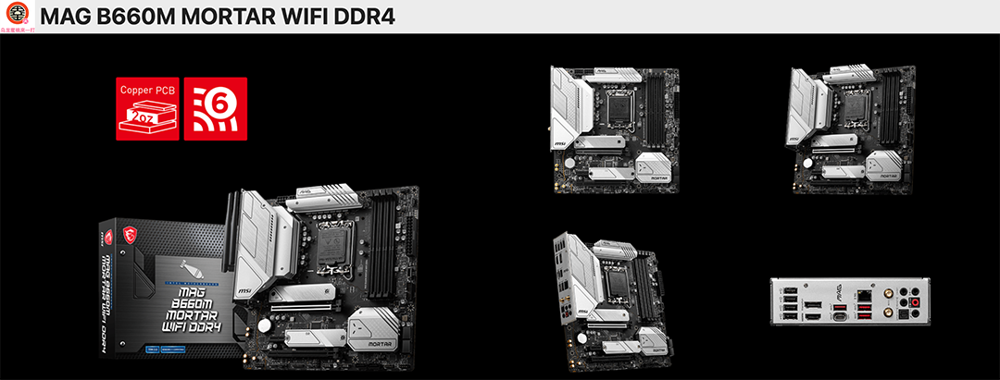
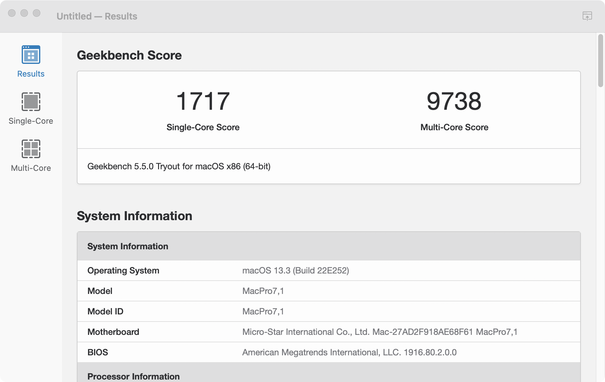
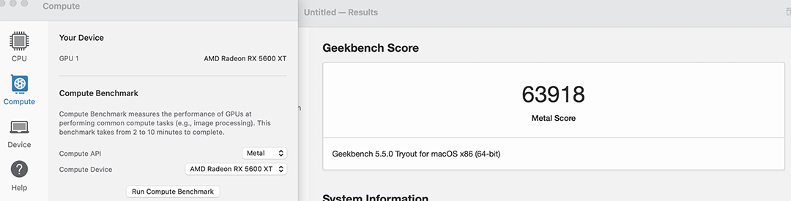

# [MSI-MAG-B660M-MORTAR-WIFI-DDR4](https://www.msi.com/Motherboard/MAG-B660M-MORTAR-WIFI-DDR4) Hackintosh OpenCore EFI

### [简体中文](https://github.com/hackintosh-efi/MAG-B660M-MORTAR-WIFI-DDR4-OpenCore)

[OpenCore 0.9.4](https://github.com/acidanthera/OpenCorePkg)

### OS Version Tested

- macOS Ventura 13.5

### Hardware

- Motherboard: MSI-MAG-B660M-MORTAR-WIFI-DDR4
- Bios Version: 7D42v1C（2023-06-04)
- CPU: Intel i5-13400
- RAM: KingBank 2x16GB DDR4 3600MHz
- SSD: ZHITAI Ti7100Plus 1TB Windows
- SSD: WD_BLACK SN770 1TB MacOS
- iGPU: Intel UHD730 (Only work in Windows)
- GPU: DATALAND Radeon RX 5600 XT 6GB X-Serial War
- Audio: Realtek ALC256
- Ethernet: Realtek 8125
- Wireless: Intel Wi-Fi 6E AX211
- Display:SANC G7c 2k 27inch 165Hz
- PSU: COOLERMASTER GX650W 80Plus Gold
- CASE:Jonsbo D31

### Bios Setup

| Name        | Option   |
|-------------|----------|
| Secure Boot | Disabled |
| CFG Lock    | Disabled |
| Fast Boot   | Disabled |

### Notes

- Use [OpenCore Configurator](https://mackie100projects.altervista.org/opencore-configurator/) build your SMBIOS

### ScreenShot

- Geekbench5 Score i5-13400

- Geekbench5 Score Metal DATALAND Radeon RX 5600 XT 6GB X-Serial War

- Geekbench5 Score OpenCL DATALAND Radeon RX 5600 XT 6GB X-Serial War

### Contact Us

- QQ Group: 23304408

