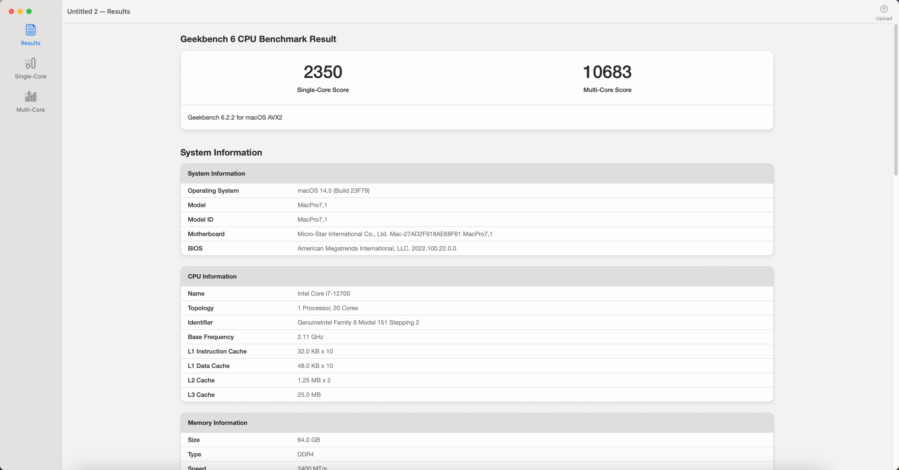
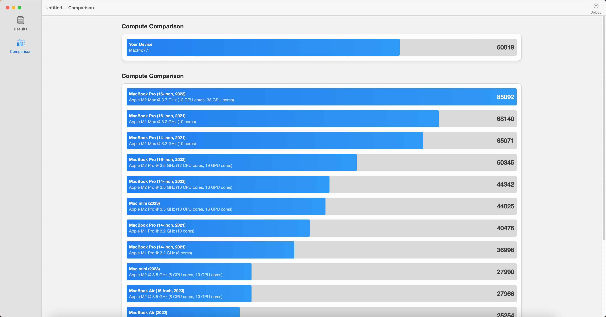

# [MSI-MAG-B660M-MORTAR-WIFI-DDR4](https://www.msi.com/Motherboard/MAG-B660M-MORTAR-WIFI-DDR4) Hackintosh OpenCore EFI

### [简体中文](https://github.com/hackintosh-efi/MAG-B660M-MORTAR-WIFI-DDR4-OpenCore)

[OpenCore 1.0.0](https://github.com/acidanthera/OpenCorePkg)

### OS Version Tested

- macOS Sonoma   14.x
- macOS Ventura    13.x
- macOS Monterey 12.x

### Hardware-1

- Motherboard: MSI-MAG-B660M-MORTAR-WIFI-DDR4
- Bios Version: 7D42v1C（2023-06-04)
- CPU: Intel i5-13400
- RAM: KingBank 2x16GB DDR4 3600MHz
- SSD: ZHITAI Ti7100Plus 1TB Windows
- SSD: WD_BLACK SN770 1TB MacOS
- iGPU: Intel UHD730 (Only work in Windows)
- GPU: DATALAND Radeon RX 5600 XT 6GB X-Serial War
- Audio: Realtek ALC256
- Ethernet: Realtek 8125
- Wireless: Intel Wi-Fi 6E AX211
- Display:SANC G7c 2k 27inch 165Hz
- PSU: COOLERMASTER GX650W 80Plus Gold
- CASE:Jonsbo D31

### Hardware-2

| 配置        | 型号                                                         |
| ----------- | ------------------------------------------------------------ |
| CPU         | 12th Gen Intel Core i7-12700                                 |
| Motherboard | MSI MAG B660M MORTAR WiFi DDR4                               |
| GPU         | AMD Radeon RX6600 Series ( 8 GB / 华硕DUAL雪豹 )             |
| RAM         | 64GB ( USCORSAIR vengers lpx DDR4 3200MHz 16GB x 2  + Kingston FURY DDR4 3200MHz 16GB x 2) |
| SSD         | WDS100T1X0E-00AFY0  SN850 SSD 1TB --MacOS14.5                |
|             | WD_BLACK SN770 SSD 500GB  --Windows11                        |
| CASE        | MATREXX 40 3F                                                |
| PSU         | Segotep AN750 750W                                           |
| CPU 风扇    | Peerless Assassin 120 SE                                     |
| Wireless    | Intel Wi-Fi 6E AX211 160MHz                                  |
| Audio       | Realtek High Definition Audio                                |

### Bios Setup

| Name        | Option   |
|-------------|----------|
| Secure Boot | Disabled |
| CFG Lock    | Disabled |
| Fast Boot   | Disabled |

### Notes

- Use [OCAuxiliaryTools](https://github.com/ic005k/OCAuxiliaryTools) build your SMBIOS
- If you want to use a CPU without  Efficient-Core, you must uncheck the option in the config.plist file Kernel--ProvideCurrentCpuinfo
- Intel WiFi driver [AirportItlwm.kext](https://github.com/OpenIntelWireless/itlwm/releases) in this EFI is only applicable to MacOS 13 Ventura. Please download and replace this driver yourself when installing other MacOS versions
- Intel WiFi Not Supported  Airdrop

### ScreenShot

- OC boot page

  

- Geekbench5 Score i5-13400

- Geekbench5 Score Metal DATALAND Radeon RX 5600 XT 6GB X-Serial War

- Geekbench5 Score OpenCL DATALAND Radeon RX 5600 XT 6GB X-Serial War

> Geekbench6 Score: i7-12700 RX5600

* Geekbench 6 CPU Benchmark Result :  intel 12700

* Single-Core Comparison: intel 12700

* Multi-Core Comparison: intel 12700

* GPU Compute Comparison: AMD RX6600

### Contact Us

- QQ Group: 23304408

