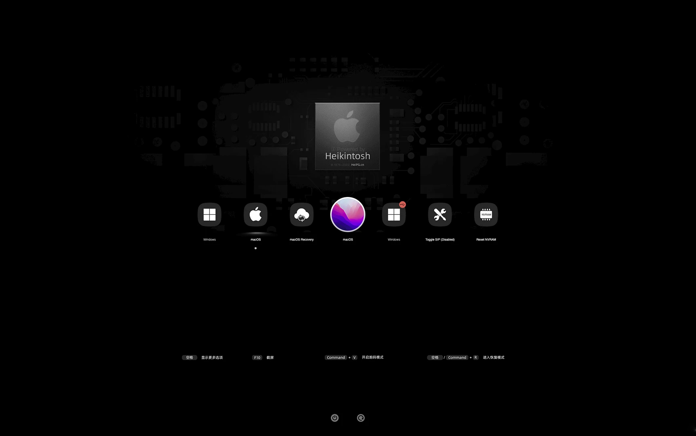
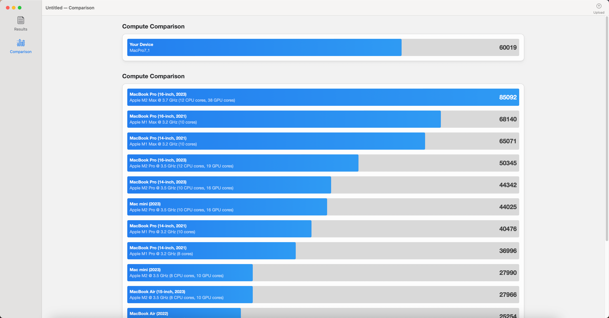

# [MSI-MAG-B660M-MORTAR-WIFI-DDR4](https://www.msi.com/Motherboard/MAG-B660M-MORTAR-WIFI-DDR4)  黑苹果 OpenCore EFI

### [English](README.EN.md)

[OpenCore 1.0.0](https://github.com/acidanthera/OpenCorePkg)

### 可安装系统

- macOS Sonoma   14.x
- macOS Ventura    13.x
- macOS Monterey 12.x

### 硬件配置一

- 主板: MSI-MAG-B660M-MORTAR-WIFI-DDR4
- Bios版本: Version: 7D42v1A（2023-01-11）
- 处理器: 英特尔 i5-13400
- 内存: 金百达 2x16GB DDR4 3600MHz
- 硬盘: 1.致态 Ti7100Plus 1TB Windows
- 硬盘: 2.西数 WD_BLACK SN770 1TB MacOS
- 独显: 迪兰 RX5600XT 6GB 战神
- 声卡: 瑞昱 ALC256
- 网卡: 瑞昱 8125
- 无线: 英特尔 WIFI 6E AX211 160MHz
- 显示器: 盛色 SANC G7c 2k 27寸 165hz
- 电源: 酷冷至尊 GX650W 80Plus 金牌全模组
- 机箱: 乔思伯 D31

### 硬件配置二

| 配置        | 型号                                                         |
| ----------- | ------------------------------------------------------------ |
| CPU         | 英特尔 12th Gen Intel Core i7-12700                          |
| 主板        | 微星 MSI MAG B660M MORTAR WiFi DDR4                          |
| 显卡        | AMD Radeon RX6600 Series ( 8 GB / 华硕DUAL雪豹 )             |
| 内存        | 64GB ( 海盗船复仇者 DDR4 3200MHz 16GB x 2  + 金士顿野兽 DDR4 3200MHz 16GB x 2) |
| SSD         | 西数 WDS100T1X0E-00AFY0 (黑盘 SN850) (固态硬盘) 1TB --MacOS14.5 |
|             | 西数 WD_BLACK SN770 500GB (固态硬盘) --Windows11             |
| 机箱        | 九州风神 玄冰40 3F                                           |
| 电源        | 鑫谷 AN750 750W                                              |
| CPU 风扇    | 利民 PA120 SE 塔式                                           |
| WiFi + 蓝牙 | 英特尔 Wi-Fi 6E AX211 160MHz                                 |
| 声卡        | 瑞昱  @ 英特尔 High Definition Audio 控制器                  |

### Bios 设置

| Name        | Option |
|-------------|--------|
| Secure Boot | 关闭     |
| CFG Lock    | 关闭     |
| Fast Boot   | 关闭     |

### 注意事项

- 使用 [OCAuxiliaryTools](https://github.com/ic005k/OCAuxiliaryTools) 生成 SMBIOS
- 如需使用没有小核心的CPU，必须取消勾选配置文件中Kernel--ProvideCurrentCpuinfo选项
- 此EFI中的英特尔无线网卡驱动[AirportItlwm.kext](https://github.com/OpenIntelWireless/itlwm/releases)仅适用于 MacOS 13 Ventura,安装其它版本请自行下载替换此驱动
- 英特尔无线网卡无法使用隔空投送等功能

### 参考内容

[1.黑苹果安装过程演示](https://hackintosh.club/d/10000060)

[2.英特尔无线网卡WiFi驱动](https://hackintosh.club/d/10000015)

[3.英特尔无线网卡蓝牙驱动](https://hackintosh.club/d/10000017)

[4.我的B站黑苹果教程](https://space.bilibili.com/244390800/video)

[6.黑果之家](https://hackintosh.club)

### 系统截图

- OC引导

  

- Geekbench5 跑分 i5-13400

- Geekbench5 跑分 Metal 迪兰 RX5600XT 6GB 战神

- Geekbench5 跑分 OpenCL 迪兰 RX5600XT 6GB 战神

> Geekbench6 Score: i7-12700 RX5600

* Geekbench 6 CPU Benchmark Result :  intel 12700

* Single-Core Comparison: intel 12700

* Multi-Core Comparison: intel 12700

* GPU Compute Comparison: AMD RX6600

### 联系我们

- QQ群: 23304408

